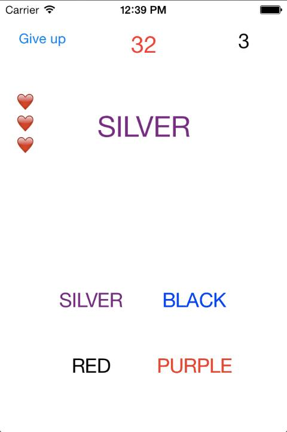

# ColorGame

This is a little game I made in the second year of university, made possible by the MacBook rental program I requested(and was successfully approved) in SKKU.  
The goal was to learn the structure of iOS apps.  
Using Objective C, this game was made in a couple of weeks from the ground up.  
The game's goal is to pick the color from the options(string matching) that correctly matches the color of the main text(literal color that the text is written in). It's supposed to be challenging due to conflicting senses.  
The sample screenshot of the game is as below.  
The app is no longer unavailable due to the developer license ending.  
  
# Screenshot

# Dev stacks
Objective-C  
Apple Game Center API
